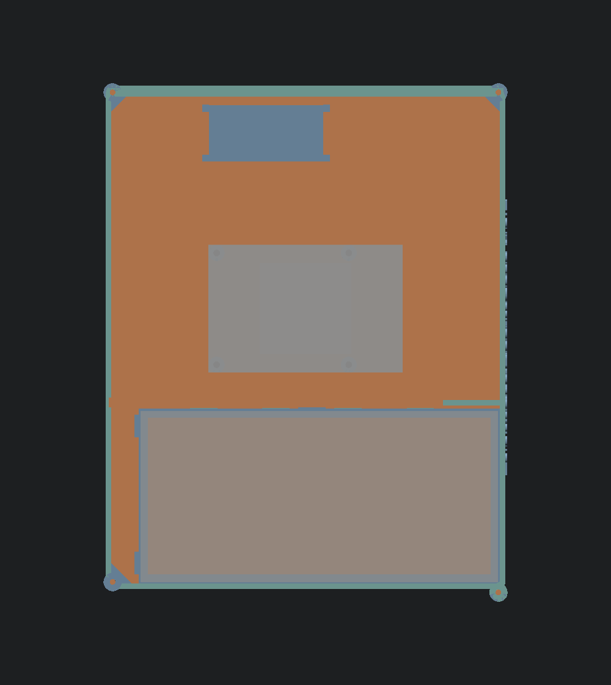
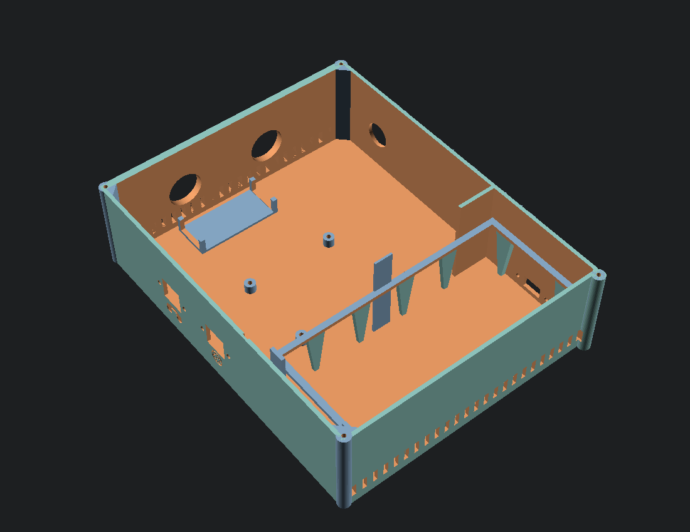
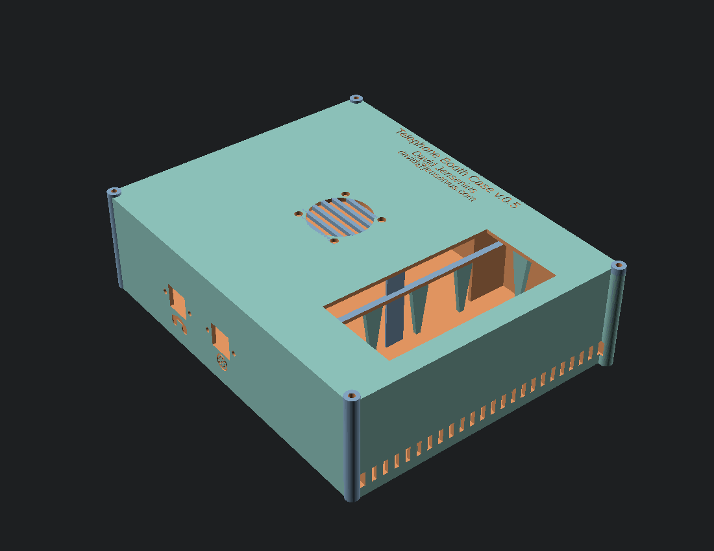
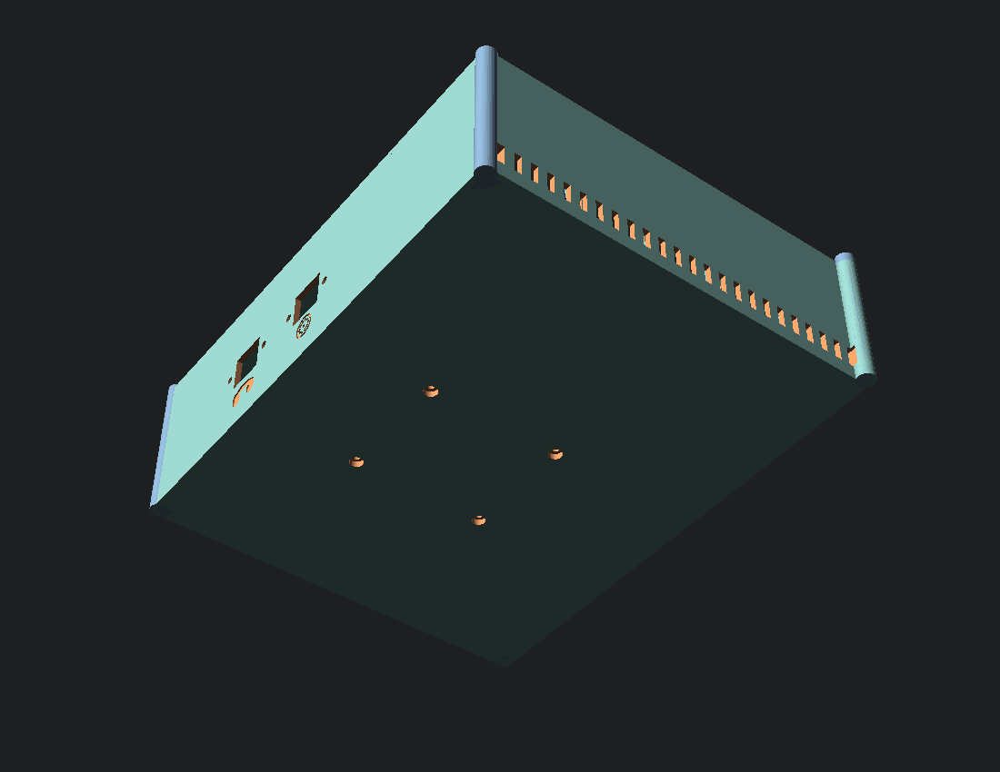
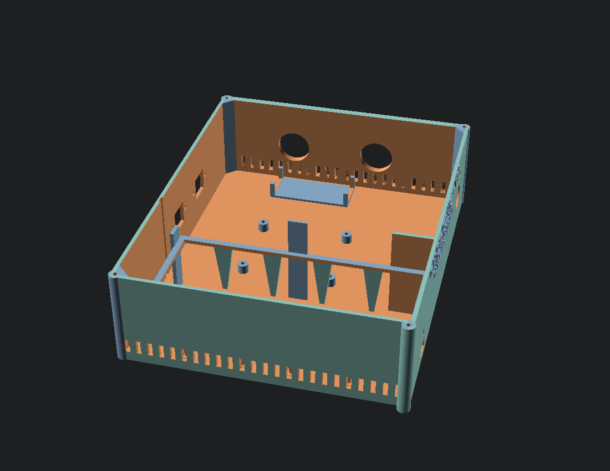
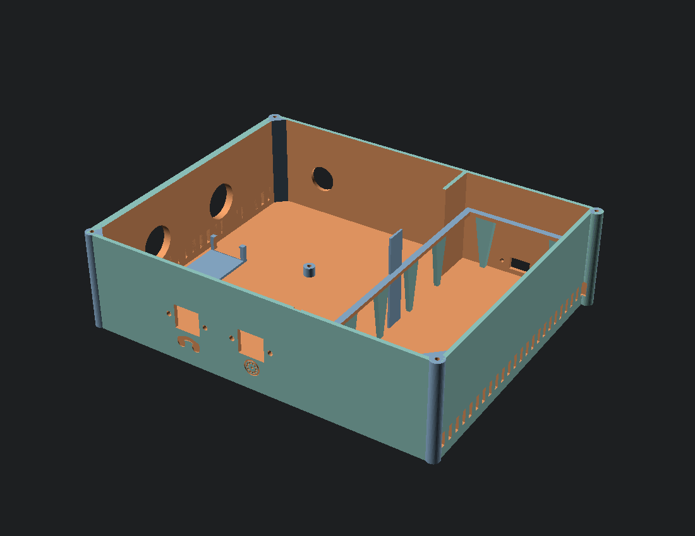
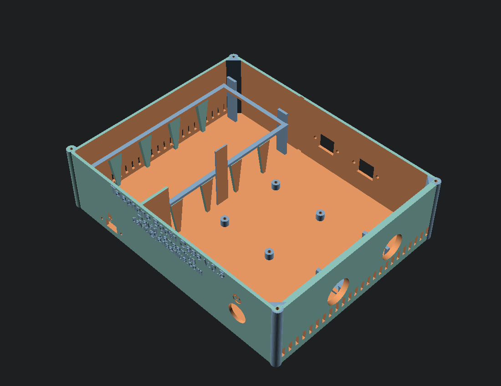
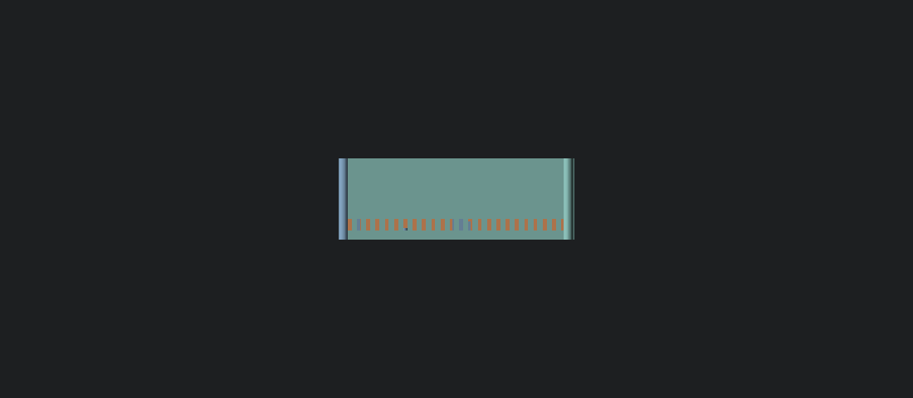
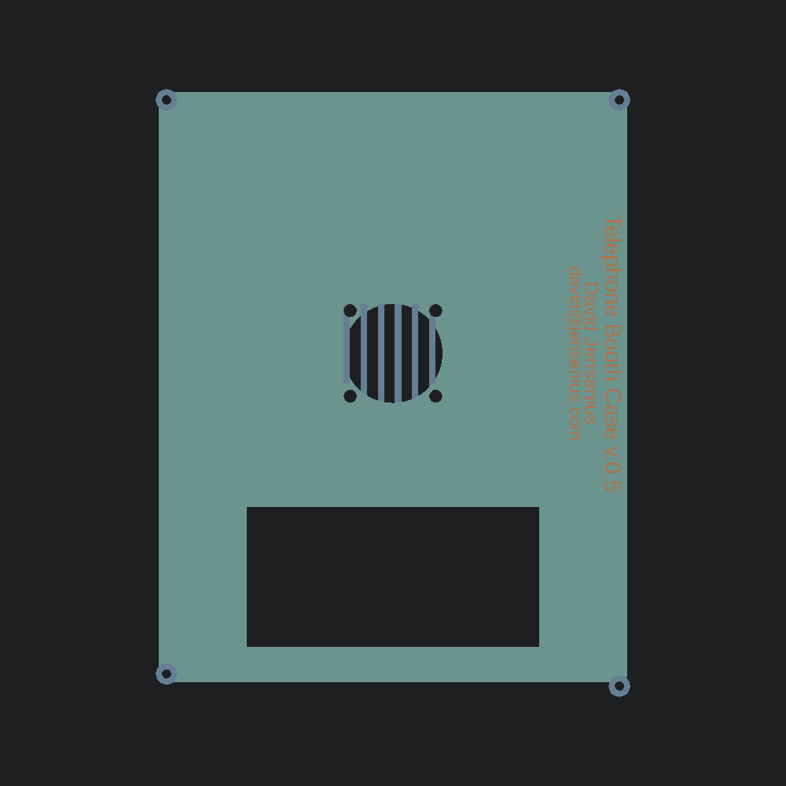

# Telephone Booth Case

A parametric, 3D-printable enclosure for the [Telephone-Booth](https://github.com/djensenius/Telephone-Booth)
art project. It is a two-bay, screw-down (M3 corner-post) case that houses:

- **Back bay** — Raspberry Pi 4B + 52Pi GPIO Screw Terminal HAT, with a Noctua
  NF-A4x20 fan mounted on the lid.
- **Front bay** — GL.iNet MUDI 7 (GL-E5800) travel router, lying flat screen-up in
  a cradle so the screen shows through the lid window. The cradle rests on tapered
  support pillars that reduce print stringing.

Internal wiring runs between the bays through the central divider, which is left
open on the router's left end so the router's ethernet door can swing open and the
power cable can reach the Pi. Power path: external USB-C inlet → router power in;
the router's USB-out feeds the Pi via a right-angle USB dongle (the reason the
router bay has extra room on that end). Two panel RJ45 keystones wire to the 52Pi
HAT (GPIO).

Current embossed version: **v.0.2**

## Components

Parts the case is designed around (official product pages where available, Amazon
otherwise). Panel-cutout dimensions are matched by measurement to the specific
parts linked below — swapping a part may require adjusting the model.

| Component | Where it goes | Cutout | Link |
| --- | --- | --- | --- |
| Raspberry Pi 4 Model B | Back bay | 58 × 49 mm hole pattern | [raspberrypi.com](https://www.raspberrypi.com/products/raspberry-pi-4-model-b/) |
| 52Pi GPIO Screw Terminal HAT (EP-01129) | On the Pi | — | [52pi.com](https://52pi.com/products/52pi-gpio-screw-terminal-hat-for-raspberry-pi) |
| GL.iNet MUDI 7 (GL-E5800) 5G travel router | Front bay | cradle | [gl-inet.com](https://www.gl-inet.com/products/gl-e5800/) |
| Noctua NF-A4x20 40 mm fan | Lid | ⌀37 mm grille, 32 mm screws | [noctua.at](https://noctua.at/en/nf-a4x20-flx) |
| Round USB 3.0 panel-mount bulkhead, 86-type (×2) | Back wall (→ Pi USB-A) | ⌀22.6 mm round | [Amazon.ca](https://www.amazon.ca/dp/B0F2MW7XXZ) |
| USB-C 3.1 panel-mount coupler | Router-bay right wall (power inlet) | 13 × 8 mm, 23.5 mm screws | [Amazon.ca](https://www.amazon.ca/dp/B0GF22WM9T) |
| HDMI female → micro-HDMI screw-fixing panel-mount bulkhead | Right wall (→ Pi micro-HDMI) | ⌀23 mm round, M22×1.5 nut | [Amazon.ca](https://www.amazon.ca/dp/B0BRFS28JM) |
| RJ45 CAT6 keystone panel-mount (×2, GPIO) | Left wall | 16.5 × 13.1 mm, 24.5 mm screws | [Amazon.ca](https://www.amazon.ca/dp/B071FNHVXN) |
| Rugged metal RGB pushbutton, 16 mm (Pi power) | Right wall | ⌀16 mm round | [adafruit.com](https://www.adafruit.com/product/3350) |
| Right-angle USB-A → USB-A cable, 30 cm | Router USB-out → Pi power | — (internal) | — |

Fasteners: M2.5 screws for the Pi standoffs (driven up from the underside); the
Noctua fan ships with its own self-tapping screws.

## Parts (printed)

| File | Part | Description |
| --- | --- | --- |
| [`telephone-booth-case.scad`](telephone-booth-case.scad) | Source | Parametric OpenSCAD model (all dimensions live here) |
| [`base.stl`](base.stl) | Base | Two-bay body with standoffs, cradle + tapered supports, panel cutouts and vents |
| [`lid.stl`](lid.stl) | Lid | Snap-fit lid with fan grille and router screen window |

Outer size: **~175.3 × 220.6 × 43.8 mm**. Both parts are embossed with the version,
author (David Jensenius) and contact (david@jensenius.com).

## Previews

| Preview | View |
| --- | --- |
|  | Top-down layout with router + Pi ghosts |
|  | Interior, both bays |
|  | Assembled — fan grille + screen window |
|  | Assembled underside |
|  | Interior from the router (USB-C) end — cradle supports |
|  | Interior from the dongle end — divider opened for cabling |
|  | Interior from the rear — cradle supports + left stops |
|  | Embossed label on the base front wall |
|  | Embossed label on the lid top |

## Printing / rendering

Requires [OpenSCAD](https://openscad.org/).

```sh
openscad -D 'part="base"' -o base.stl telephone-booth-case.scad
openscad -D 'part="lid"'  -o lid.stl  telephone-booth-case.scad
```

Use `-D 'part="check"'` for a translucent fit check with router and Pi ghosts.

## Versioning

The version is defined once, in the `label` parameter at the top of
`telephone-booth-case.scad`, embossed on both parts, and mirrored by the git tag
(embossed `v.0.1` ⇔ tag `v0.1`). See [`.github/copilot-instructions.md`](.github/copilot-instructions.md)
for the bump workflow.

## Related repositories

- [Telephone-Booth](https://github.com/djensenius/Telephone-Booth) — main project
- [Telephone-Booth-Operator](https://github.com/djensenius/Telephone-Booth-Operator)
- [Telephone-Booth-Operator-Mobile](https://github.com/djensenius/Telephone-Booth-Operator-Mobile)
